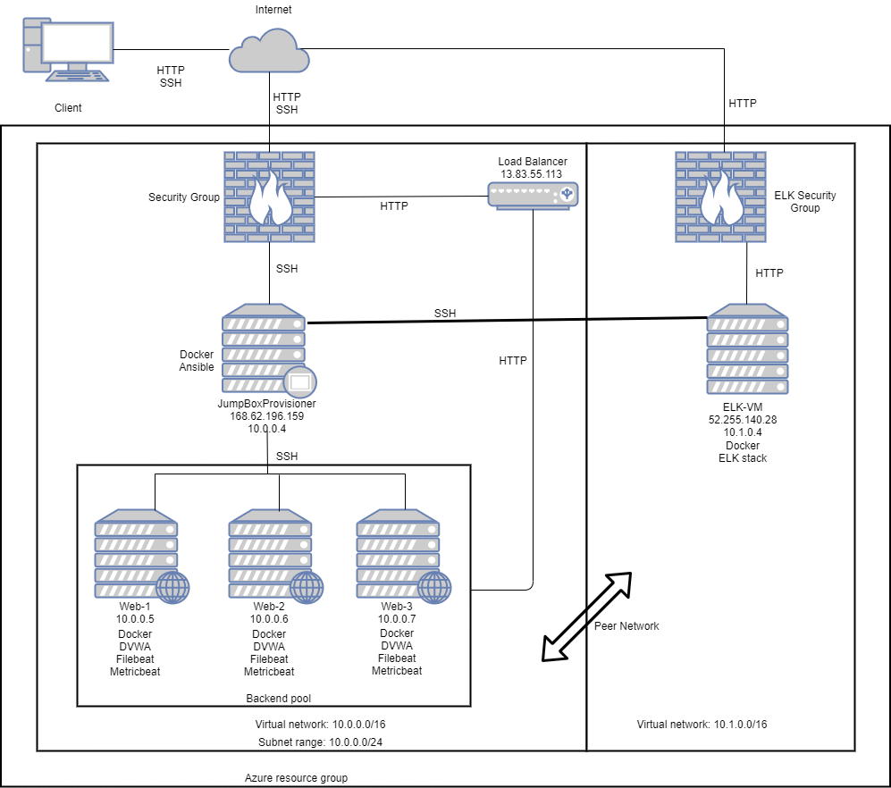
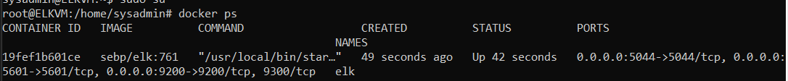

# CybersecurityProject1
Elk Stack Project
## Automated ELK Stack Deployment

The files in this repository were used to configure the network depicted below.



These files have been tested and used to generate a live ELK deployment on Azure. They can be used to either recreate the entire deployment pictured above. Alternatively, select portions of the playbook file may be used to install only certain pieces of it, such as Filebeat.

  - [install-elk.yml](Ansible/install-elk.yml)
  - [filebeat-config.yml](Ansible/filebeat-config.yml)
  - [metricbeat-config.yml](Ansible/metricbeat-config.yml)
  - [filebeat-playbook.yml](Ansible/filebeat-playbook.yml)
  - [metricbeat-playbook.yml](Ansible/metricbeat-playbook.yml)

This document contains the following details:
- Description of the Topology
- Access Policies
- ELK Configuration
  - Beats in Use
  - Machines Being Monitored
- How to Use the Ansible Build


### Description of the Topology

The main purpose of this network is to expose a load-balanced and monitored instance of DVWA, the D*mn Vulnerable Web Application.

Load balancing ensures that the application will be highly available, in addition to restricting access to the network.

Integrating an ELK server allows users to easily monitor the vulnerable VMs for changes to the services and system files.

The configuration details of each machine may be found below.
_Note: Use the [Markdown Table Generator](http://www.tablesgenerator.com/markdown_tables) to add/remove values from the table_.

| Name     | Function | IP Address | Operating System |
|----------|----------|------------|------------------|
| Jump Box | Gateway  | 10.0.0.4   | Linux            |
| Web-1    | DVWA Host| 10.0.0.5   | Linux            |
| Web-2    | DVWA Host| 10.0.0.6   | Linux            |
| Web-3    | DVWA Host| 10.0.0.7   | Linux            |

### Access Policies

The machines on the internal network are not exposed to the public Internet. 

Only the gateway machine can accept SSH connections from the Internet. Access to this machine is only allowed from the following IP addresses:
Home Network IP

Machines within the network can only be accessed by the gateway machine.

A summary of the access policies in place can be found in the table below.

| Name     | Publicly Acessible | Allowed IP Address         |
|----------|--------------------|----------------------------|
| Jump Box | Yes                | 10.0.0.1 10.0.0.2 Home_IP  |
| Web-1    | No                 | 10.0.0.4                   |
| Web-2    | No                 | 10.0.0.4                   |
| Web-3    | No                 | 10.0.0.4                   |

### Elk Configuration

Ansible was used to automate configuration of the ELK machine. No configuration was performed manually, which is advantageous because it reduces human error and allows for automation.

The playbook implements the following tasks:
- Install docker.io
- Install pip3
- Install Docker module
- Download and launch docker Elk container
- Enable docker service

The following screenshot displays the result of running `docker ps` after successfully configuring the ELK instance.



### Target Machines & Beats
This ELK server is configured to monitor the following machines:
10.0.0.5
10.0.0.6
10.0.0.7

We have installed the following Beats on these machines:
Filebeat
Metricbeat

These Beats allow us to collect the following information from each machine:
Filebeat logs information about the file system, including which files have changed and when.
Metricbeat collects metrics from the systems and services, including CPU usage and other statistics.

### Using the Playbook
In order to use the playbook, you will need to have an Ansible control node already configured. Assuming you have such a control node provisioned: 

SSH into the control node and follow the steps below:
- Copy the filebeat-config.yml file to /etc/ansible/files/filebeat-config.yml.
- Update the filebeat-config.yml file to include the IP address of the Elk machine for hosts (Lines #1106, #1806)
- Run the playbook, and navigate to http://[your.VM.IP]:5601/app/kibana to check that the installation worked as expected.

```ansible-playbook /etc/ansible/roles/filebeat-playbook.yml```

